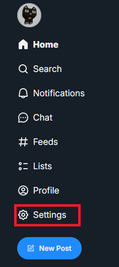
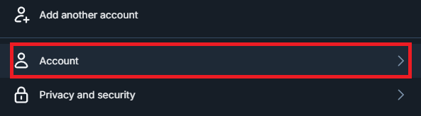
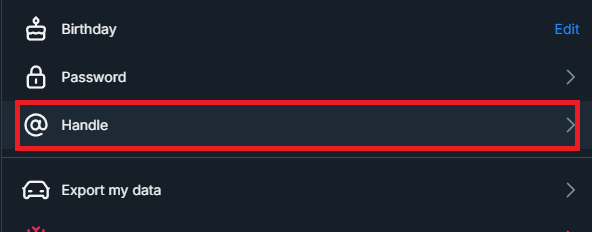
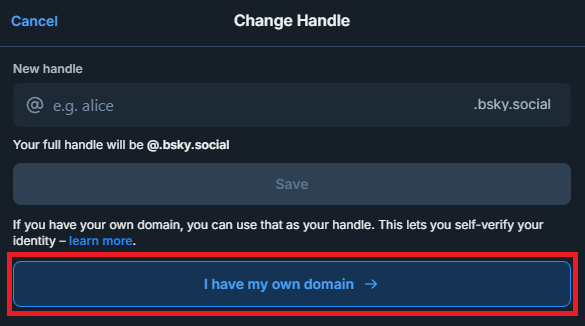
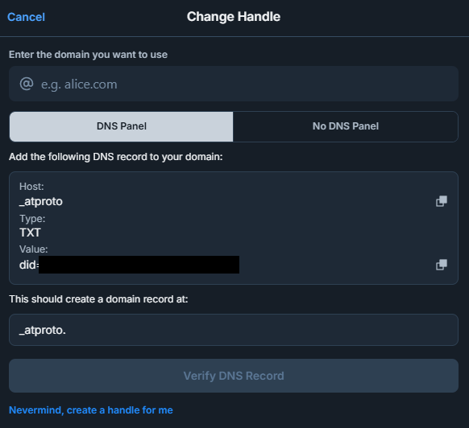
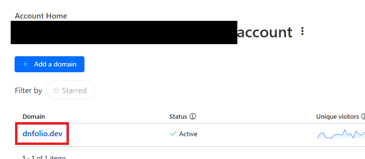
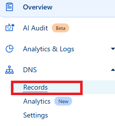
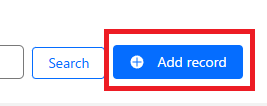
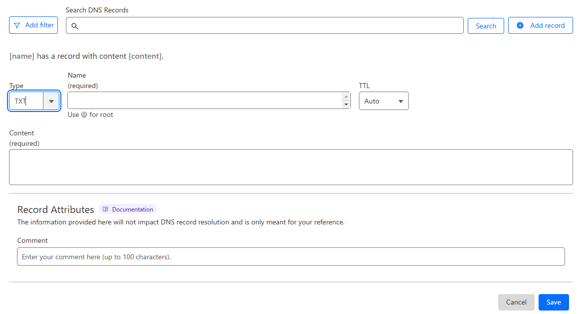
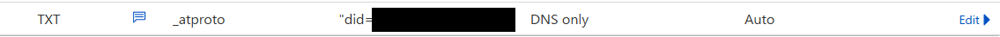

My Bluesky account used **daiki48.bsky.social** .

And now I've updated my Bluesky account handle to **dnfolio.dev** .
I will share how to set this up for **Cloudflare Registrar** , where I manage the domain.

## How to set up

### Bluesky side

Select Bluesky **settings** button.  

Select **Account** button.

Select **Handle** button.

Select **I have my own domain** button.

Enter the domain you want to use.

Select **DNS Panel** tab.

### Cloudflare side

In the account home, select the domain.

In the left sidebar, Select **DNS Records** button.

Select **Add record** button.

Enter the **Type**, **Name**, **Content** .

> [!NOTE]
> **Name** corresponds to **Host** and **Value** corresponds to **Content** .

Added record.

### Return Bluesky side

Press the **Verify DNS Record** button.

Then I was able to update the Bluesky handle. Congratulations!!

When you refresh the Bluesky screen, the handle displayed on your profile screen is set to the value you have set.
Glad to see that.
